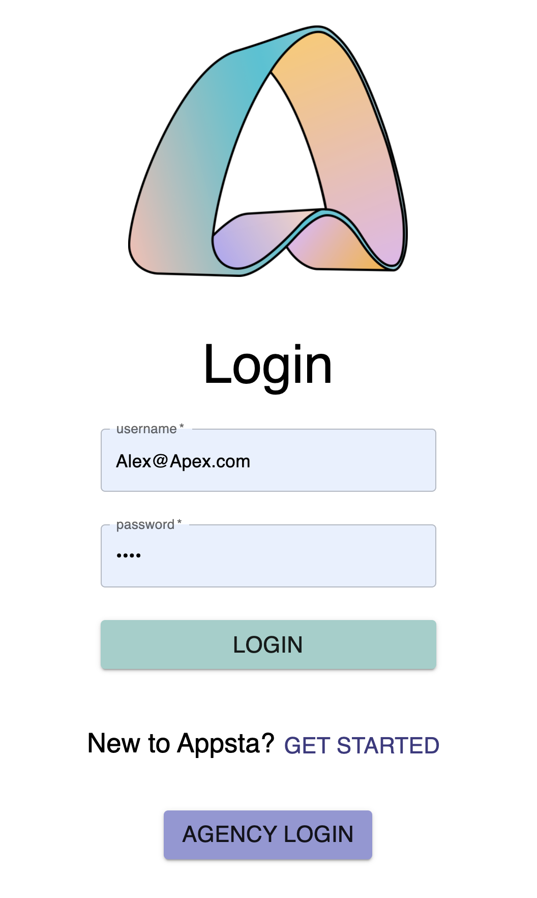
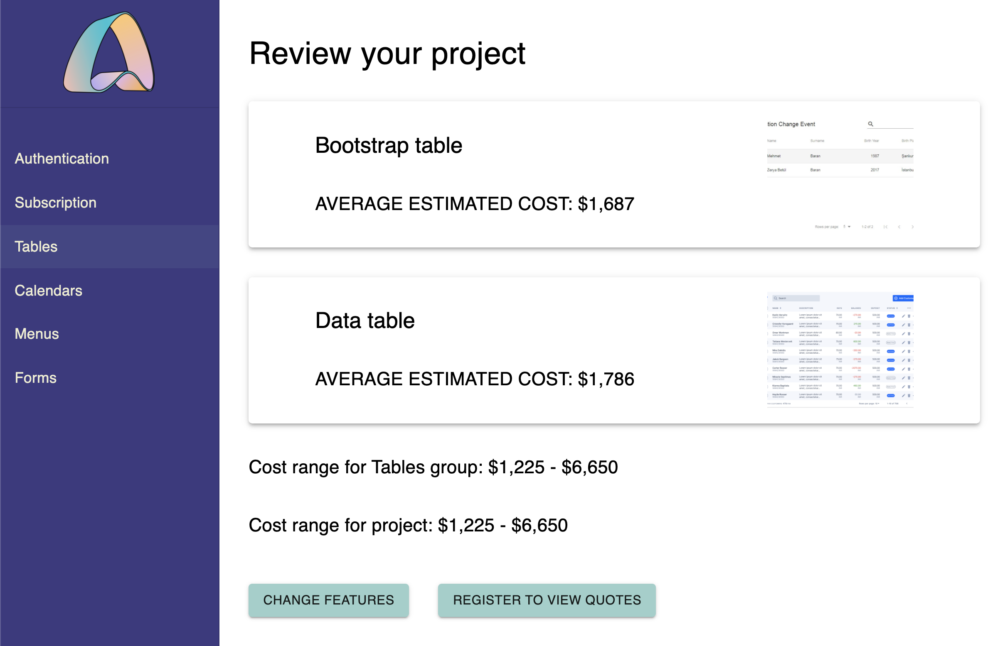
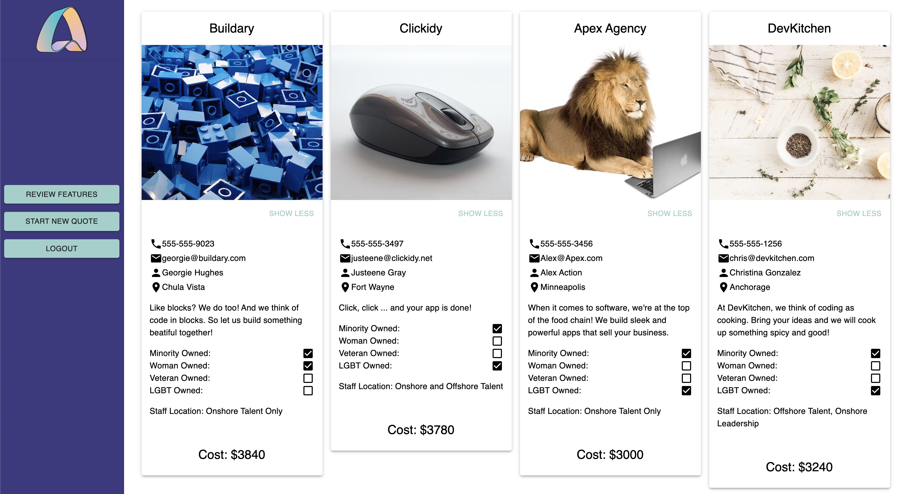

# Appsta 

## Description 
Duration: 2 week sprint 

Appsta is an easy to use web development marketplace for Startups. Startups can browse a variety of web development features, interact with these features, and select those relevant to their project. This application will help Startups plan, budget, and review their web development needs in a non-threatening environment. 
  
To see the fully functioning site, please visit: DEPLOYED VERSION OF APP (HEROKU - coming soon)

## Screenshots 

Login View 

Quotes View

Review Saved Quotes 

# Getting Started
Please see these instructions for how to get a copy of this project up and running on your local machine.  

# Prerequisites 

[Node.js](https://nodejs.org/en/)

[Postgres](https://www.postgresql.org/)

[Nodemon](https://nodemon.io/)

# Installation 

1. Create a database named "appsta"
2. The queries in the database.sql file are set up to create and populate all of the needed tables for your application to run correctly. This project was built on [Postgres](https://www.postgresql.org/), so be sure to have it installed. We used `Postico` and highly recommend that do too, to run the queries.
3. Open your choice of edit and run an npm install
4. Run `npm run server` in your terminal 
5. Run `npm run client` in your terminal 
6. The npm run client command will open up a new browser tab, where your app will spin up. 
# Usage 

1.  New Buyer will use the application by clicking "Get Started".
2. New Buyer can select feature categories from the side navigation bar.
3. New Buyer can then select features and quantities to add to project.  
4. New Buyer can submit project for project cost estimate range and feature cost estimate range. 
5. New Buyer can click "Get Quotes" and  be taken to a registration screen.  
6. New Buyer registration is a 3 step process.  Complete each required field to populate the next button to move forward with registration. 
7. After completing registration, the New User will be able to view a list of agencies and their quote for the submitted project.  
8.  The New User can filter through the quotes by the tags listed on the top of the page.
9.  The New User can select agencies and their quotes to save to their dashboard. 
10.  The New User can see contact information for Agencies by clicking "learn more" on the Agency cards.
11. The New User can chose to start a new project and chose new features to get an estimate and quotes for.  

# Built with 

JavaScript, 
React, 
Redux,
Saga,
Express, 
Passport,
Node.js,
HTML,
CSS,
Material UI,
PostgreSQL,
Postman- for testing, and
Postico- for the database

# Acknowledgement
Thank you Lee Zuvanich for presenting our team with the opportunity to work on Appsta.   Thanks to Prime Digital Academy who equipped and helped us to make this application a reality. Our instructors Dane, Liz, and Kris.

